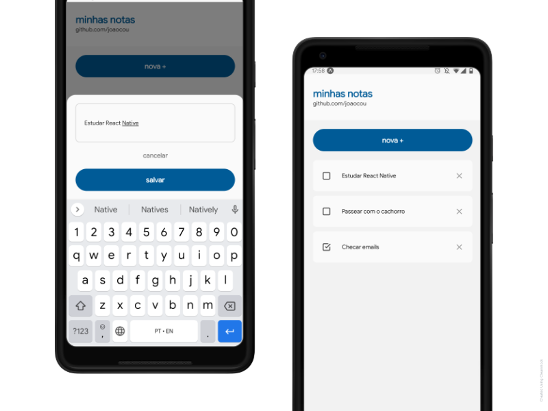

<p align="center">
   
</p>

# <a href="https://github.com/joaocou/native-notes">Native Notes</a>

[](https://github.com/joaocou)
[](https://github.com/joaocou/native-notes/)
[](https://github.com/joaocou/native-notes/)


> Um app de anotações simples, feito com React Native.


### 📌 Sumário

- <a href="#Caracteristicas">Características</a>
- <a href="#Telas">Telas</a>
- <a href="#Tecnologias">Tecnologias</a>
- <a href="#Guia">Guia de início</a>
- <a href="#Contribuindo">Contribuindo</a>

<hr>

### <span id="Caracteristicas">⚙️ Características</span>

- Listar, adicionar e excluír notas;
- Marcar notas como concluídas;
- Temas: escuro e claro (não implementado);


### <span id="Telas">📱 Telas</span>

<div style="display:flex;flex-wrap:wrap;justify-content:center;width:100%;">
   
</div>

### <span id="Tecnologias">💻 Tecnologias</span>

- React Native;
- Expo;
- Expo Vector Icons;
- SQLite Database;
- Styled Components;


### <span id="Guia">⚡ Guia de início</span>

Antes de tudo, esteja certo de que você tenha o NodeJS e o Yarn instalado em sua máquina.

```bash
$ cd native-notes
$ yarn install
$ yarn start
# Pronto!
```

### <span id="Contribuindo">🧰 Contribuindo</span>

Não hesite em enviar pull requests caso encontre algum problema, bug, ou algo que possa ser melhorado no projeto!

<hr>

Feito por <a href="https://github.com/joaocou">João Couto</a>